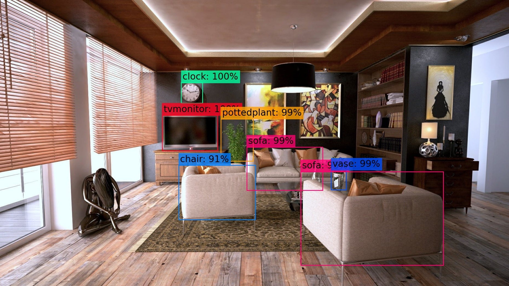

# A simple YOLOv3 Object Detection API in Python (Flask)

This repository provides a simple implementation of object detection in Python, served as an API using Flask. It is based on the YOLOv3 object detection system and we will be using the pre-trained weights on the COCO dataset. 
